## Saoirse's Burgers

Mockup of Saoirse's Burgers

Deployed Saoirse's Kitchen App Link
Github Repo Link

### Table of Contents
* [Responsive Mockup]()
* [Overview](https://github.com/sblakedev/Project4)
* [User Experience](https://github.com/sblakedev/Project4#user-experience)
    * [Site Goals](https://github.com/sblakedev/Project4#site-goals)
    * [Agile Workflow](https://github.com/sblakedev/Project4#agile-workflow)
    * [Design](https://github.com/sblakedev/Project4#design)
* [Features](https://github.com/sblakedev/Project4#features)
    * [Navbar](https://github.com/sblakedev/Project4#navbar)
    * [Hero](https://github.com/sblakedev/Project4#hero-section)
    * [About](https://github.com/sblakedev/Project4#about-section)
    * [Menu](https://github.com/sblakedev/Project4#menu-section)
    * [Testimonials](https://github.com/sblakedev/Project4#testimonials-section)
    * [Staff](https://github.com/sblakedev/Project4#staff-section)
    * [Gallery](https://github.com/sblakedev/Project4#gallery)
    * [Contact](https://github.com/sblakedev/Project4#contact)
    * [Footer](https://github.com/sblakedev/Project4#footer)
    * [Account Sign Up](https://github.com/sblakedev/Project4#account-sign-up)
    * [Login](https://github.com/sblakedev/Project4#login)
    * [Booking Page](https://github.com/sblakedev/Project4#booking-page)
    * [My Bookings](https://github.com/sblakedev/Project4#my-bookings)
    * [Delete Booking](https://github.com/sblakedev/Project4#delete-booking)
* [Technologies Used](https://github.com/sblakedev/Project4#technologies-used)
    * [Languages](https://github.com/sblakedev/Project4#languages)
    * [Frameworks, Libraries & Programs Used](https://github.com/sblakedev/Project4#frameworks-libraries--programs-used)
* [Testing](https://github.com/sblakedev/Project4#testing)
* [Deployment](https://github.com/sblakedev/Project4#deployment)
* [Credits](https://github.com/sblakedev/Project4#credits)
    * [Code](https://github.com/sblakedev/Project4#code)
    * [Content](https://github.com/sblakedev/Project4#content)
    * [Acknowledgements](https://github.com/sblakedev/Project4#acknowledgements)

Username = admin
email address = admin@saoirsesburgers.ie
password = cheese2658

### Overview
The Saoirse's Burgers website is for a fictional burger restaurant. It is for people who want somewhere casual and friendly to eat. Users can create an account to book a table. They can then edit or delete their booking.

The live project is here:

### User Experience
#### Site Goals
* These are the goals for this site:
    1. Allow user to create an account with the restaurant
    2. Allow user to make a booking at the restaurant
    3. Allow user to update or cancel a booking
    4. Allow site owner to build a database of customers who have booked tables

* User Stories
    * New User
        1. As a new user, I want to view the menu so that I can decide if I want to book a table
        2. As a new user, I want to book a table at the restaurant
        3. As a new user, I want to choose the date, time and number of guests for my booking
        4. As a new user, I want to tell the restaurant if the booking is for a special occasion
        5. As a new user, I want to create an account

    * Returning User
        1. As a returning user, I want to be able to log in to my account
        2. As a returning user, I want to be able to book a table at the restaurant
        3. As a returning user, I want to be able to edit or cancel my reservation
        4. As a returning user, I want to be able to view my reservations

#### Agile Workflow
The Agile workflow was used in creating this site. Tasks were prioritised by using GitHub Issues and assigning User Stories to those Issues.

#### Design
* Colour Scheme
The main colours used are Red and white. This Red ties in well with the theme of a burger restaurant, as thanks to McDonald's it suggests a casual eatery. The White suggests clean and fresh which is what the restaurant wants customers to think of.

* Font
The font is clear and casual which again, ties in with the relaxed atmosphere of the restaurant.

* Images
Images used show tasty, fresh burgers to show users what the main dish is.

* Wireframes

* Database Schema
The database design is seen below. The Booking model has a relationship with the built-in Django model of User through the foreign key

### Features
#### Navbar

The navbar shows all of the sections of the site at first glance. By clicking on one of the tabs, it will take the user further down the page to the corresponding section.

#### Hero Section
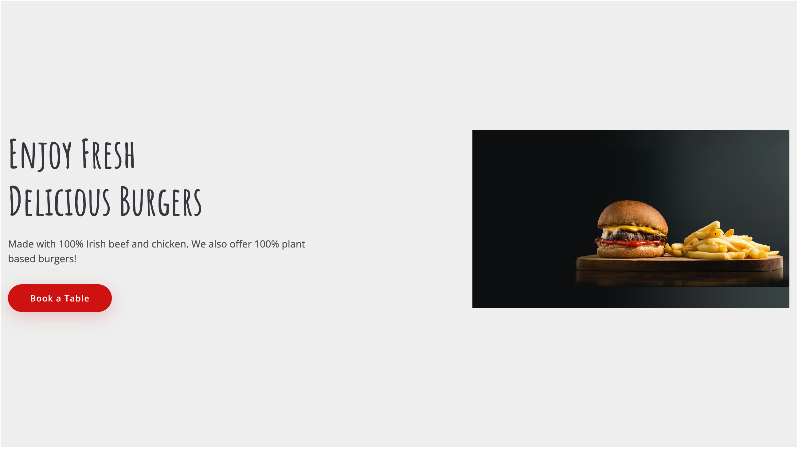
The hero section clearly shows the type of food on offer at this estabishment and features a button to Book a Table.

#### About Section
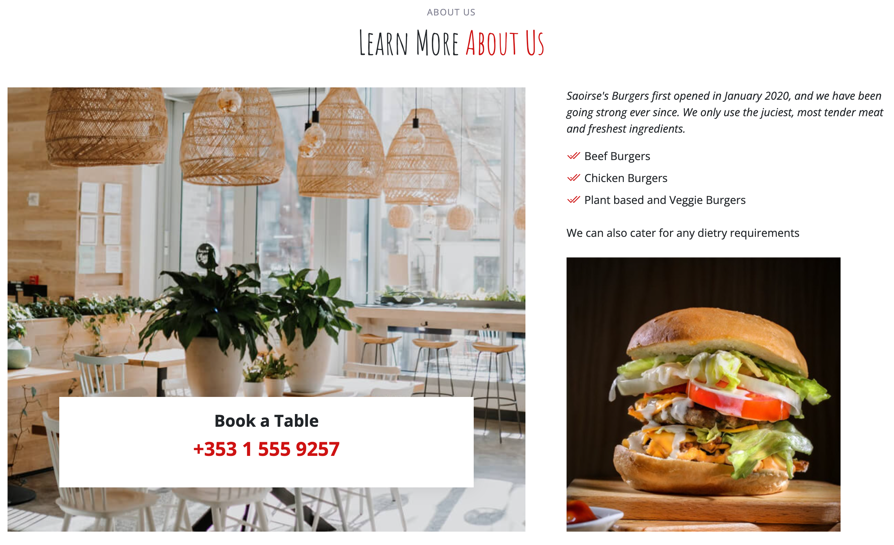
The about section allows the user to learn more about the restaurant, when it was established, what their mission is. It also provides the phone number to call to book a table.

#### Menu Section
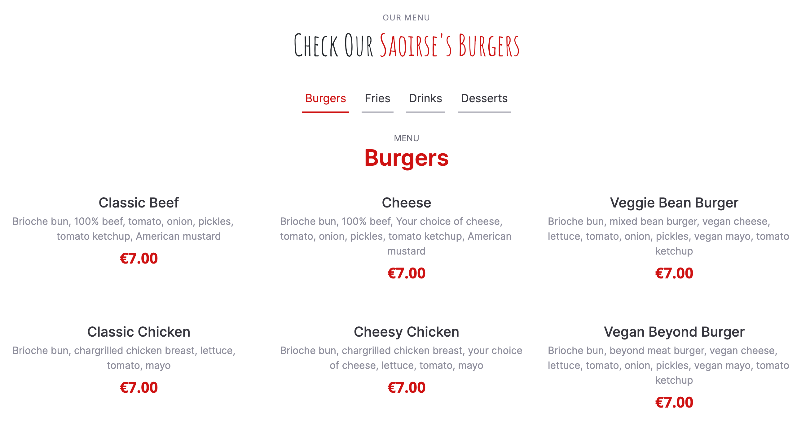
The menu section shows all of the dishes on offer. There are Burgers, Fries, Drinks and Desserts tabs which when clicked show what's available in each category. The ingredients used in each dish are underneath the name and is followed by the price, so that users have all the information available to them before they decide to book a table.

#### Testimonials Section
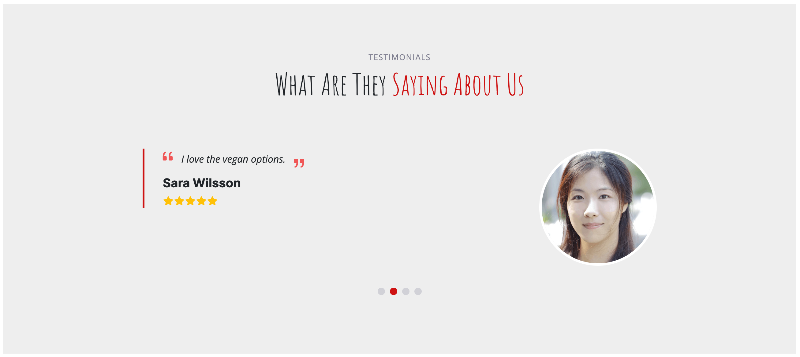
The testimonials section features quotes from people who have eaten at the restautant before so that users can see other opinions before they decide to book a table.

#### Staff Section
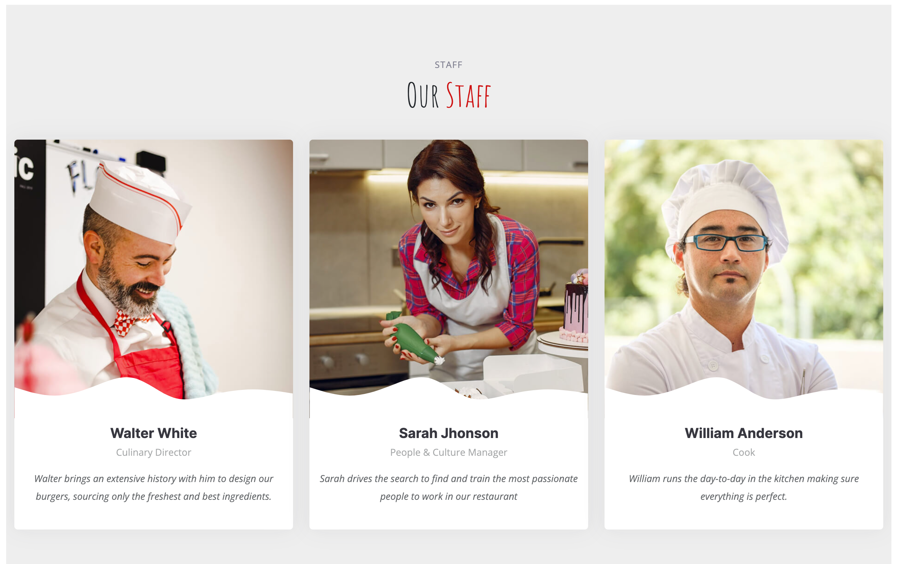
The staff section features pictures of 3 main staff in the restaurant. This means that users can feel like they know a bit more about the staff and what their values are. This may make the user feel more comfortable in the restaurant.

#### Gallery
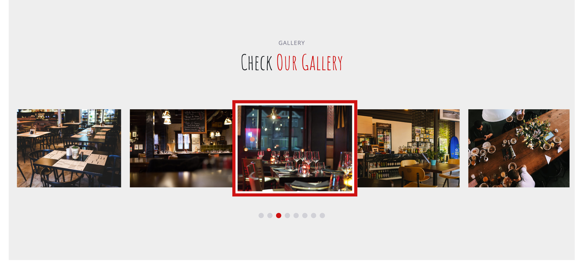
The gallery section features some photos of the restaurant. Again, this helps the user feel like they know the restaurant before they've ever been there and may help them feel morea comfortable.

#### Contact
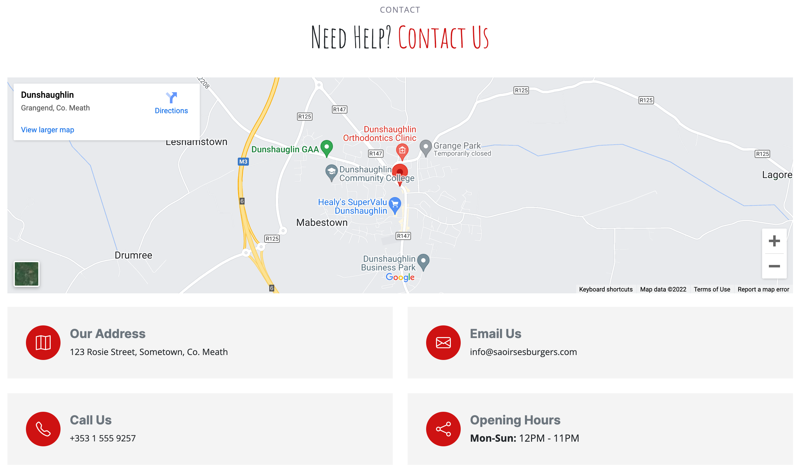
The contact section features the address, email address, phone number and opening hours of the restaurant.

#### Footer

The footer section features the contact information again and also links to social media. These links open the homepage of those sites in a new tab.

#### Account Sign Up
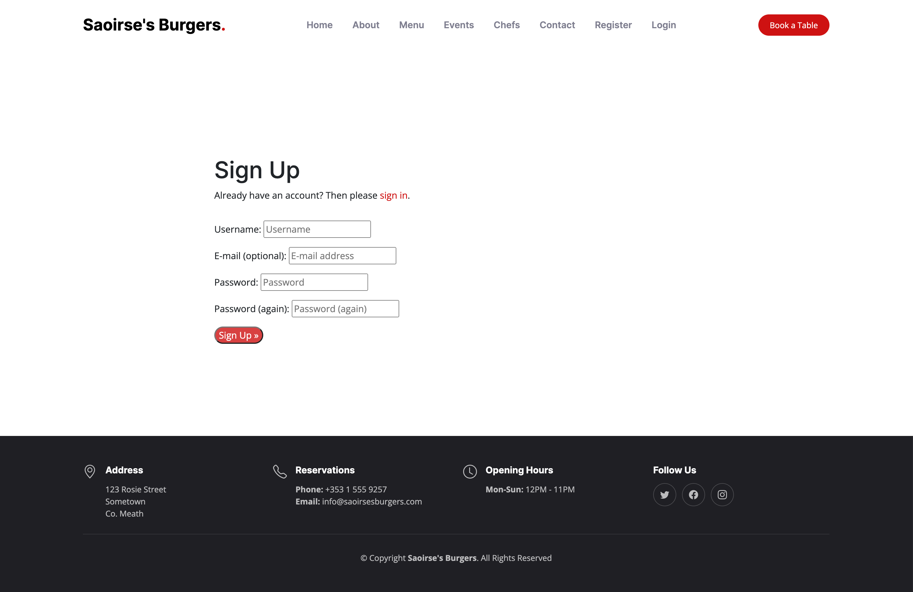
The account sign up section features a form that the user can fill in in order to create an account.

#### Login
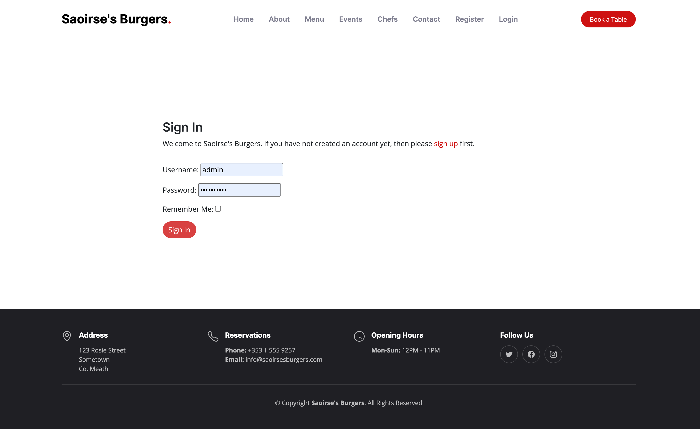
The login section allows the user to log in.

#### Booking Page
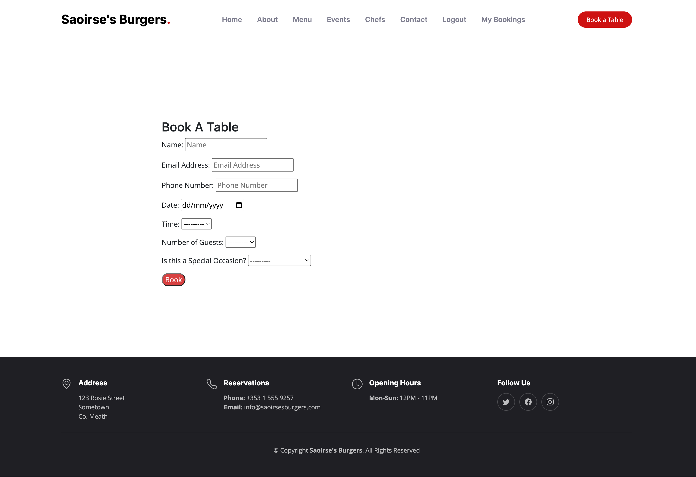
The booking page allows the user to create a booking using the form. This will then appear in the user's My Bookings page

#### My Bookings
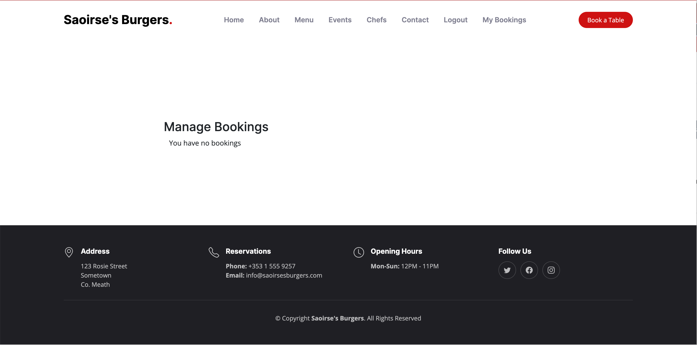
This page shows the user's current booking or no bookings if they havenot booked a table yet. From here, the user can edit or delete a booking by clicking on the corresponding button.

#### Delete Booking

When the user clicks the Delete button, a warning message will appear so that the user can confirm if they want to delete the booking or not.

### Technologies Used
#### Languages
* Python
* Javascript
* HTML5
* CSS3

#### Frameworks, Libraries & Programs Used
* os
* Django
* Allauth
* Cloudinary
* Gunicorn
* Psycopg2

* Bootstrap
Used to design the front end
* Google Fonts
Used to choose the fonts
* Balsamic
Used to create wireframes
* LucidCharts
Used to create the database schema

### Testing

#### Bugs
After creating models, I can't see the email field when creating a new booking in the admin panel.

### Deployment
#### Heroku
1. Log in to Heroku
2. On the dashboard, under user profile, click New and Create New App
3. Name app and set region to Europe. Click Create App
4. Click on the settings tab
5. Click on Reveal Config Vars and enter the following:
6. PORT for the key and 8000 for the value and click Add.
7. Then enter CLOUDINARY_URL, DATABASE_URL, and SECRET_KEY and their values.
8. Go back to the top of the page and click on the Deploy tab
9. Scroll down to Deployment method and choose GitHub
10. Search for the repository that you want to connect to
11. Click Connect beside the repository you want to connect to
12. Scroll down to Automatic Deploys
13. Under Choose a branch to deploy, choose Main
14. Click Enable Automatic Deploys

### Credits
#### Code
Yummy Bootstrap Theme was the theme used for this site
Django Documentation was used to understand and implement code and functionality
Code Institute Walkthroughs for "Hello Django" and "I Think Therefore I Blog" were used for code examples and guidance

#### Content
Media
Some images came from the Yummy Bootstrap Theme
Other images came from the Feane Bootstrap Theme

#### Acknowledgments
My mentor Martina Terlevic for fantastic guidance and support.
The Slack community
Inspiration for the ReadMe came from the Code Institute Sample ReadMe, Code Institute ReadMe template, my own Project 1, 2 and 3 ReadMe's and ErikHgm's Firehouse Restaurant Project ReadMe.
